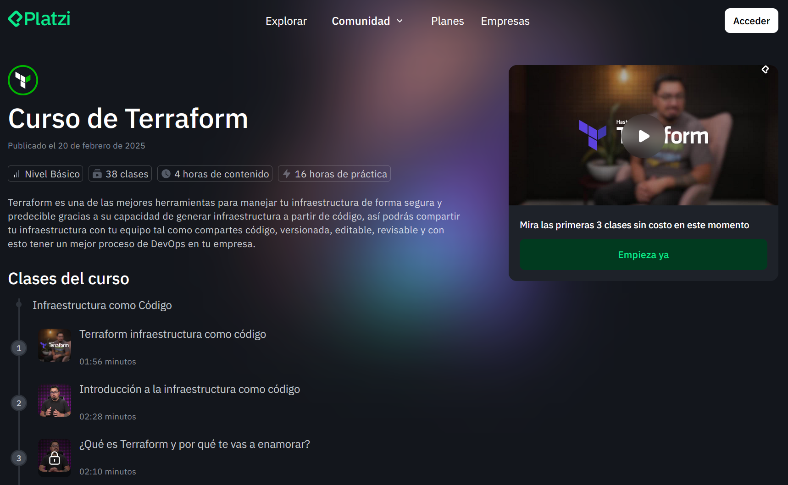

# Curso de Terraform

¡Hola! En este repositorio encontrarás todos los recursos que te pueden ayudar para aprender en tu curso de Terraform con Platzi.

Puedes ver el curso completo en este [enlace](https://github.com/platzi/curso-terraform.git).

## Temario del curso

### Infraestructura como código

* Clase 1 **Gratis**: [Terraform infraestructura como código](https://platzi.com/clases/11819-terraform/74109-terraform-infraestructura-como-codigo/)  
* Clase 2 **Gratis**: [Introducción a la infraestructura como código](https://platzi.com/clases/11819-terraform/74110-introduccion-a-la-infraestructura-como-codigo/)  
* Clase 3: [¿Qué es Terraform y por qué te vas a enamorar?](https://platzi.com/clases/11819-terraform/74111-que-es-terraform-y-por-que-te-vas-a-enamorar/)  
* Clase 4: [Instalación de Terraform en Ubuntu](https://platzi.com/clases/11819-terraform/74112-instalacion-de-terraform-en-ubuntu/)  
* Clase 5: [Creación de una cuenta en Azure](https://platzi.com/clases/11819-terraform/74113-creacion-de-una-cuenta-en-azure/)  
* Clase 6: [Instalación y uso de Azure CLI](https://platzi.com/clases/11819-terraform/74114-instalacion-y-uso-de-azure-cli/)  
* Clase 7: [Estructura del lenguaje HCL](https://platzi.com/clases/11819-terraform/74115-estructura-del-lenguaje-hcl-configuracion-de-vscod/)  

### Fundamentos de Terraform

* Clase 8: [Proveedores de Terraform](https://platzi.com/clases/11819-terraform/74116-proveedores-de-terraform/)  
* Clase 9: [El comando terraform init](https://platzi.com/clases/11819-terraform/74117-el-comando-terraform-init/)  
* Clase 10: [El comando terraform plan](https://platzi.com/clases/11819-terraform/74118-el-comando-terraform-plan/)  
* Clase 11: [El comando terraform apply](https://platzi.com/clases/11819-terraform/74119-el-comando-terraform-apply/)  
* Clase 12: [El comando terraform destroy](https://platzi.com/clases/11819-terraform/74120-el-comando-terraform-destroy/)  
* Clase 13: [Despliega tu primer grupo de recursos](https://platzi.com/clases/11819-terraform/74121-despliega-tu-primer-grupo-de-recursos/)  

### Variables y estado

* Clase 14: [Variables en Terraform](https://platzi.com/clases/11819-terraform/74122-variables-en-terraform/)  
* Clase 15: [Valores de salida (outputs) en Terraform](https://platzi.com/clases/11819-terraform/74123-valores-de-salida-outputs-en-terraform/)  
* Clase 16: [Tu primer recurso desplegado](https://platzi.com/clases/11819-terraform/74124-tu-primer-recurso-desplegado-con-terraform/)  
* Clase 17: [Extracción del proveedor en un archivo propio en Terraform](https://platzi.com/clases/11819-terraform/74125-extraccion-del-proveedor-en-un-archivo-propio-en-t/)  
* Clase 18: [Introducción al estado dentro de Terraform](https://platzi.com/clases/11819-terraform/74126-introduccion-al-estado-dentro-de-terraform/)  
* Clase 19: [Configuración del estado remoto en Terraform](https://platzi.com/clases/11819-terraform/74127-configuracion-del-estado-remoto-de-terraform/)  
* Clase 20: [Desplegando mi infraestructura con un estado remoto](https://platzi.com/clases/11819-terraform/74128-desplegando-mi-infraestructura-con-un-estado-remot/)  

### Bloques y comandos útiles

* Clase 21: [El bloque data en Terraform](https://platzi.com/clases/11819-terraform/74129-el-bloque-data-en-terraform/)  
* Clase 22: [Comandos fmt y validate en Terraform](https://platzi.com/clases/11819-terraform/74130-comandos-fmt-y-validate-en-terraform/)  

### Creación y gestión de recursos

* Clase 23: [Creando una máquina virtual](https://platzi.com/clases/11819-terraform/74131-creando-una-maquina-virtual/)  
* Clase 24: [Agregando componentes a mi solución](https://platzi.com/clases/11819-terraform/74132-agregando-componentes-a-mi-solucion/)  

### Módulos en Terraform  

* Clase 25: [Introducción a los módulos en Terraform](https://platzi.com/clases/11819-terraform/74133-introduccion-a-los-modulos-en-terraform/)  
* Clase 26: [Fragmentando mi solución en módulos en Terraform](https://platzi.com/clases/11819-terraform/74134-fragmentando-mi-solucion-en-modulos-en-terraform/)  
* Clase 27: [El bloque locals en Terraform](https://platzi.com/clases/11819-terraform/74135-el-bloque-locals-en-terraform/)  
* Clase 28: [El bloque import en Terraform](https://platzi.com/clases/11819-terraform/74136-el-bloque-import-en-terraform/)  
* Clase 29: [Diferencias entre import y data](https://platzi.com/clases/11819-terraform/74137-diferencias-entre-import-y-data/)  
* Clase 30: [Presentación al registro de Terraform](https://platzi.com/clases/11819-terraform/74138-presentacion-al-registro-de-terraform/)  
* Clase 31: [Planeando mi primer módulo en Terraform](https://platzi.com/clases/11819-terraform/74139-planeando-mi-primer-modulo-en-terraform/)  
* Clase 32: [Estructurando mi módulo en Terraform](https://platzi.com/clases/11819-terraform/74140-estructurando-mi-modulo-en-terraform/)  
* Clase 33: [Publicando mi módulo en Terraform](https://platzi.com/clases/11819-terraform/74141-publicando-mi-modulo-en-terraform/)  

### Integración y despliegue continuo

* Clase 34: [Integración continua con Terraform y Github Actions](https://platzi.com/clases/11819-terraform/74142-integracion-continua-con-terraform-y-github-action/)  
* Clase 35: [Despliegue continuo con Terraform y Github Actions](https://platzi.com/clases/11819-terraform/74143-despliegue-continuo-con-terraform-y-github-actions/)  
* Clase 36: [Mejores prácticas de CI/CD para Terraform](https://platzi.com/clases/11819-terraform/74144-mejores-practicas-de-cicd-para-terraform/)  

### Documentación y recursos

* Clase 37: [Navegación en la documentación de Terraform](https://platzi.com/clases/11819-terraform/74145-navegacion-en-la-documentacion-de-terraform/)  

## Profesor

Tu profesor para este curso es [Amin Espinoza](https://platzi.com/profes/aminespinoza/), Senior Software Engineer en Microsoft.

[Github de Amin Espinoza](https://github.com/aminespinoza10)  
[LinkedIn de Amin Espinoza](https://www.linkedin.com/in/aminespinoza/)
